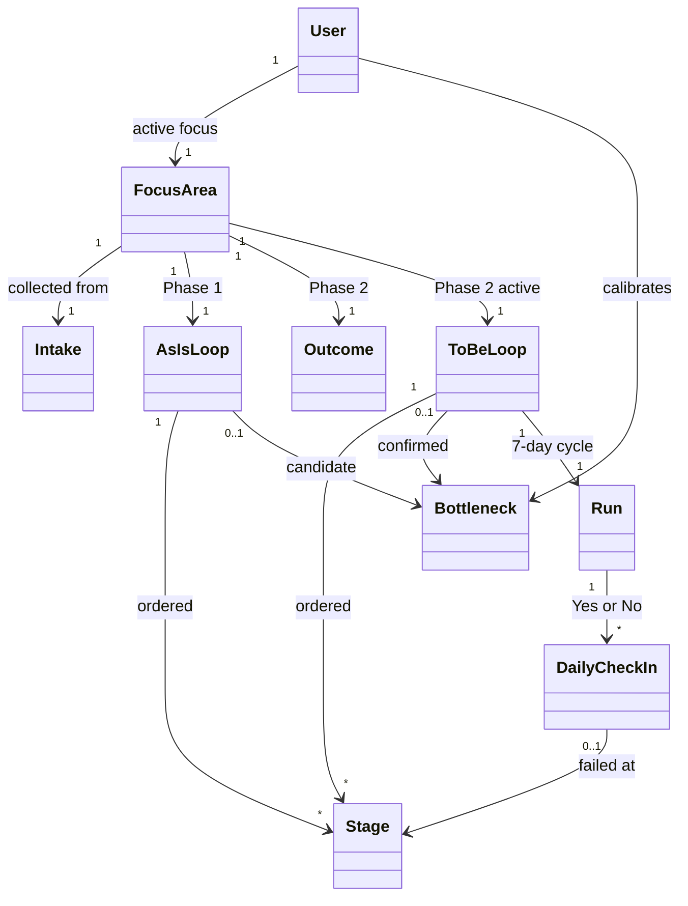
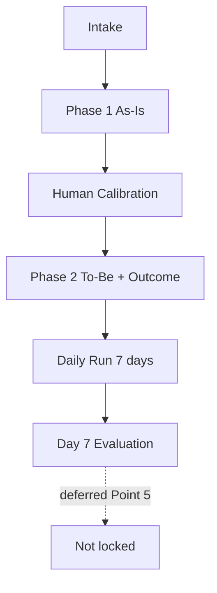

# Ubiquitous Language — Personal Behaviour Systems

**Status:** Working conclusions (domain design)  
**Last updated:** 2026-08-23  
**Scope:** Language. Implementation contracts live in `system-architecture.md` and `invariants.md`.

---

## 1. Product sentence (anchor)

A person redesigns **one part of life** by making their **daily behaviour** visible as an **editable flow**, then improves that flow using **what actually happens over time**.

This is **not** a habit streak tracker, a todo list, or a life knowledge graph of nouns.

The operating pattern is **Design → Run → Signal → Adapt**: diagnose the current day (As-Is), confirm the bottleneck, redesign a target routine (To-Be), then log daily execution.

---

## 2. Core terms

| Term | Means | Does **not** mean |
|------|--------|-------------------|
| **User** | The person designing their system | A team or coach (later) |
| **FocusArea** | One life slice under redesign right now | Their whole life OS at once |
| **Intake** | Choose/click answers about aim chips, current day, cues, failure points | A written essay; a committed Outcome |
| **AsIsLoop** | Phase 1 baseline: what actually happens today | The ideal future routine |
| **Human Calibration** | User confirms or adjusts the candidate bottleneck (and may edit As-Is blocks) | Auto-accepting the LLM guess |
| **ToBeLoop** | Phase 2 redesigned target routine; the single active loop | A second parallel life system |
| **Outcome** | What “better” means; synthesized in Phase 2 after bottleneck confirm | A daily score; a pre-loop required essay |
| **BehaviourLoop** | The recurring flow of Stages (As-Is or To-Be role) | A concept/knowledge graph |
| **Stage** | One block in that flow (the interactive unit) | A generic node; a metric |
| **Cue** | What starts or prompts a Stage | A goal; a resource inventory |
| **Environment** | Context around a Stage | A separate life domain |
| **Friction** | How a Stage tends to fail (`currentFriction` on As-Is) | A free-floating “lazy” label |
| **RedesignIntervention** | Environment/cue hack on a To-Be Stage | A lecture; a new goal |
| **Bottleneck** | The one Stage that most stalls the current loop (candidate, then confirmed) | Every problem at once |
| **DailyCheckIn** | One day’s Yes/No log of the active To-Be loop | A multi-metric journal |
| **Run** | The 7-day calendar cycle of check-ins | A single checkbox with no date window |
| **Signal** | Evidence over time (DailyCheckIn is the first Signal) | Vanity stats |

---

## 3. Decision point (resolved)

A **decision point is a Stage**, not a separate top-level concept. Cue, Environment, and Friction hang on it. The Bottleneck often points here.

---

## 4. How terms relate

```text
User
  chooses FocusArea
    completes Intake (chips; optional note)
    Phase 1 → AsIsLoop
      ordered Stages (cue, environment, currentFriction)
      candidate Bottleneck + primaryFrictionAnalysis
    Human Calibration → confirmed Bottleneck
    Phase 2 → Outcome + ToBeLoop
      ordered Stages (cue, environment, redesignIntervention)
      bottleneck Stage + coreStrategy
    Run (7 days)
      DailyCheckIn (Yes / No; if No: failedStage + frictionTag)
```

**User-facing main surface:** behaviour flow as interactive Stage blocks. As-Is is verified first; To-Be is what they run.

---

## 5. UML — domain overview



---

## 6. UML — pipeline



---

## Document history

| Date | Change |
|------|--------|
| 2026-07-30 | Initial conclusions: UL reset; Decision = Stage; UML added |
| 2026-07-30 | Removed sections on avoided words, open naming, and next steps |
| 2026-08-23 | AsIsLoop / ToBeLoop / Human Calibration / DailyCheckIn; Outcome moves to Phase 2 |
